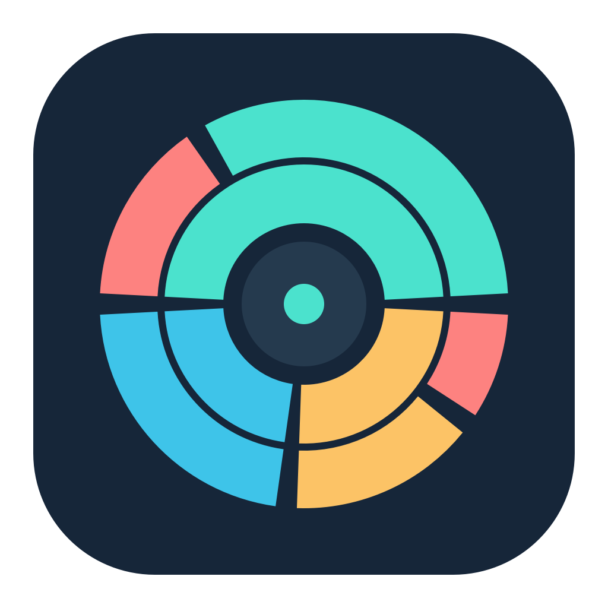
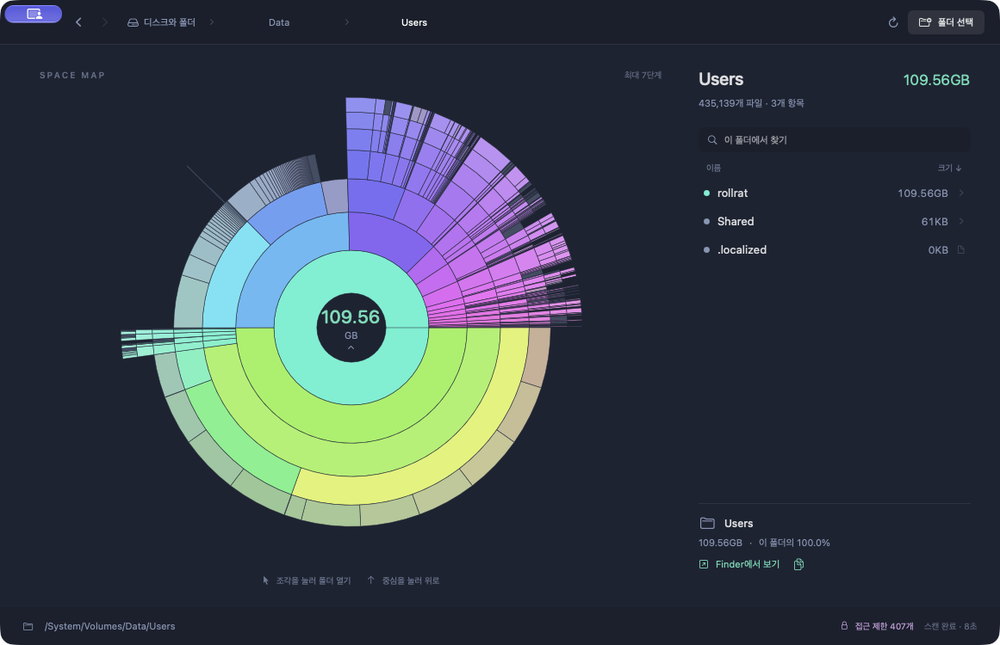

<p align="center">
  
</p>
<h1 align="center">OrbitDisk</h1>
<p align="center">내 Mac의 저장 공간을 한눈에 보는 SwiftUI 디스크 탐색기</p>



Apple Silicon Mac용 디스크 용량 탐색기입니다. `OrbitDisk.app`을 실행한 뒤 디스크나 폴더를 선택하세요.

## 새 화면

- 최대 7단계의 폴더 구조를 나타내는 원형 지도. 중심에서 멀어질수록 하위 폴더입니다.
- 조각의 각도가 용량 비율을 나타냅니다. 파일에서 끝난 가지는 바깥쪽으로 이어지지 않으므로 실제 폴더 구조마다 모양이 달라집니다.
- 지도와 목록에 같은 색상을 사용하며 마우스를 올린 항목과 그 경로가 함께 강조됩니다.
- 작은 항목은 하나의 흐린 조각으로 합쳐 표시합니다. 클릭하면 해당 항목 목록을 볼 수 있습니다.
- 디스크별 용량 표시, 현재 폴더 검색, 클릭 가능한 경로, 뒤로/앞으로 이동, 경로 복사, Finder에서 보기를 지원합니다.

## 조작

| 동작 | 방법 |
|---|---|
| 폴더 열기 | 지도 조각 또는 목록의 폴더 클릭 |
| 상위 폴더 | 원형 지도 중심 클릭, 또는 ⌘↑ |
| 뒤로 / 앞으로 | 상단 화살표, 또는 ⌘[ / ⌘] |
| 폴더 선택 | 상단 폴더 선택, 또는 ⌘O |
| 현재 폴더 다시 스캔 | 상단 새로고침, 또는 ⌘R |
| 파일 위치 확인 | 파일 선택 후 Finder에서 보기, 또는 목록 우클릭 |
| 경로 복사 | 우측 하단 복사 버튼, 또는 목록 우클릭 |
| 새 폴더 스캔 | Finder의 폴더를 창으로 끌어 놓기 |

파일을 수정하거나 삭제하지 않습니다. 스캔은 백그라운드에서 진행되고 취소할 수 있습니다. 디스크와 폴더 화면으로 돌아가도 마지막 스캔 결과를 다시 열 수 있습니다.

## 용량과 권한

지도는 파일의 할당 크기를 합산한 추정치이며 1GB = 1,000,000,000바이트로 표시합니다. APFS 스냅샷과 공유 블록, 하드 링크를 별도로 보정하지 않으므로 시스템이 표시하는 전체 사용량과 다를 수 있습니다. 읽지 못한 폴더는 하단에 접근 제한 개수로 표시되며 합계에서 제외됩니다. 앱은 권한을 자동으로 변경하지 않습니다.

## 빌드

배포된 앱은 Apple Silicon용이며 macOS 13 이상을 대상으로 빌드했습니다. 현재 Mac에서 실행과 스캔, 차트 탐색, 검색을 확인했습니다. 개인용 로컬 빌드로 Apple 공증은 받지 않았습니다.

저장소의 `build.sh`를 실행하면 `build/OrbitDisk.app`이 생성됩니다. Apple Command Line Tools의 Swift 컴파일러가 필요합니다. 전체 Xcode 설치는 필요하지 않습니다.

```sh
./build.sh
open build/OrbitDisk.app
```

핵심 동작 검증:

```sh
./test.sh
```

각도와 용량 보존, 조각 클릭 판정, 작은 항목 묶음, 7단계 제한, 탐색 이력, 검색, 부모 폴더 연결, 심볼릭 링크 순환 방지, 스캔 취소를 검사합니다.

## 소스 구성

- `Sources/OrbitDisk.swift`: 스캐너, 원형 지도, SwiftUI 화면
- `Resources/`: 앱 정보와 아이콘
- `assets/`: README 로고와 실제 앱 창 캡처
- `Tests/OrbitDiskChecks.swift`: 핵심 동작 검사
- `tools/make-icon.swift`: 로고 원본 생성 코드
